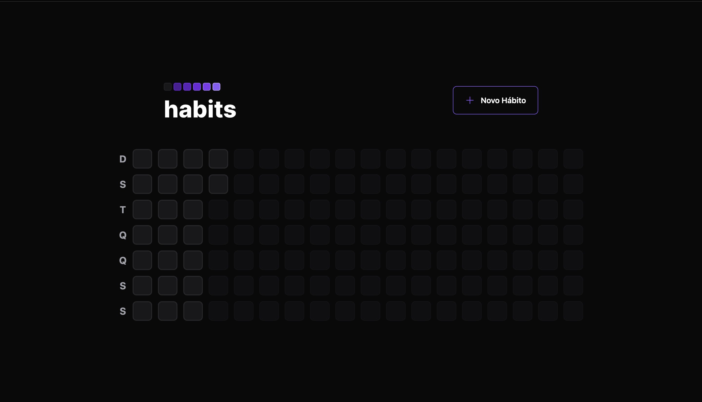
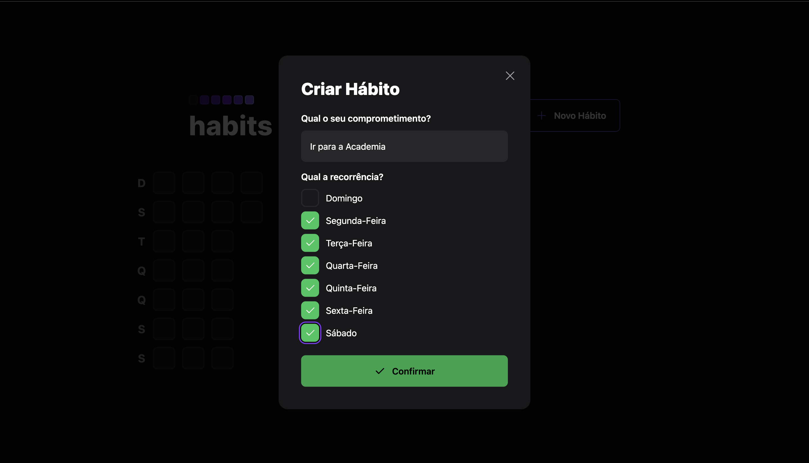

# 📸 Overview:



# 💻 Project:
## Aplicação Web e Mobile que registra os hábitos do dia a dia

# 🚀 Technologies:
### ✔️ Axios
### ✔️ ReactJS 
### ✔️ React Native
### ✔️ NodeJS 
### ✔️ Fastify
### ✔️ Prisma
### ✔️ TypeScript
### ✔️ TailwindCSS
### ✔️ Vite 

# How to run

```
# Clone this repository
$ git clone https://github.com/vinnycosta9898/nlw-setup

# Go to the directory
$ cd nlw-setup

# Install Dependencies
$ npm install

# Run Web Server
$ npm run dev